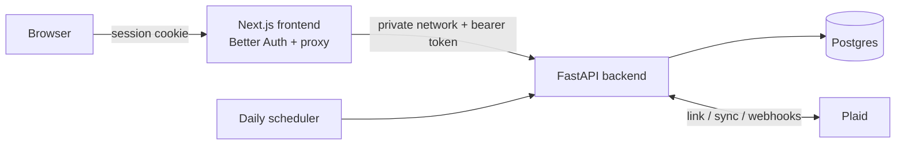

# copilot.money

A personal finance app built for one person — me. Bank sync via Plaid, budgets,
cash flow, investments, net worth, subscription detection, and (soon) an AI
layer — running on my own infrastructure, at [finance.gautamtata.com](https://finance.gautamtata.com).

Built as a replacement for the commercial Copilot Money app: same core features,
plus the ones they never shipped, with my data in my own Postgres.

## Features

- **Bank sync (Plaid, production)** — connect banks and brokerages via Plaid Link,
  including OAuth institutions (Chase, Amex, …) and investments-only brokerages
  (Robinhood). Webhook-driven syncing with a daily fallback job.
- **Transactions** — cursor-based sync engine with pending→posted matching,
  idempotent replays, soft deletes. Infinite feed with search and filters.
- **Categories & rules** — 18 seeded Copilot-style emoji categories mapped from
  Plaid's taxonomy, inline recategorization, and "always categorize X like this"
  merchant rules with retroactive application. User assignments are never
  overwritten by syncs.
- **Budgets** — monthly per-category budgets with carry-forward (a month with no
  explicit budget inherits the last one), budget-vs-actual dashboard.
- **Cash flow** — monthly income / spending / net with savings rate.
- **Investments** — holdings, allocation, prices from Plaid investments.
- **Net worth** — daily balance snapshots per account power an assets-vs-debt
  history chart; per-account balance history.
- **Recurrings** — Plaid-detected subscription streams grouped by cadence,
  monthly total, predicted next charges, "next two weeks" card.
- **Auth** — Better Auth with Google sign-in, allowlisted to a single email.
- **Design** — the "Banknote" system: light engraved-currency identity (green
  paper, pine ink, Clarendon numerals, guilloche signature). Guidelines in
  [`frontend/AGENTS.md`](frontend/AGENTS.md).

## Roadmap

### M7 — AI (next up)
- [ ] AI auto-categorization of transactions Plaid can't classify (Claude)
- [ ] Finance chat: streaming agent with read-only tools over spending, budgets, net worth
- [ ] Weekly insights: spend anomalies, new merchants, budget-pace warnings
- [ ] Review queue: confirming/fixing AI categorizations creates permanent rules

### M8 — Design (iterating)
- [x] Iteration 1: "Banknote" system shipped
- [ ] Motion polish, allocation donut, dark-mode variant
- [ ] Possibly a contrasting second direction to compare

### M9 — Beyond Copilot (the reason this exists)
- [ ] **Apple Card support** — statement (CSV/PDF) import with dedupe, since Apple Card doesn't do Plaid
- [ ] **AI financial guidance** — income/spend analysis, savings coaching, scenario questions (informational, not licensed advice)
- [ ] **Monthly reports** — AI-written recap emailed via Resend + immutable in-app Reports archive; later, multi-month trend narratives
- [ ] **Trading research** — evaluate SnapTrade / Alpaca for acting on investments from the app (Robinhood has no official API)

Full tracker lives in Linear (team: Personal Finance).

## Architecture



- The browser never talks to FastAPI directly: a Next.js catch-all route checks
  the session, then forwards over Railway's private network with a shared token.
- The backend's public surface is just a health check and the Plaid webhook
  endpoint (verified via Plaid's signing JWT).
- All money is integer cents end-to-end; security prices/quantities are NUMERIC.
- Alembic migrations run automatically on every deploy.

## Stack

| Layer      | Tech |
|------------|------|
| Frontend   | Next.js 16 (App Router), TypeScript, Tailwind v4, TanStack Query, Recharts, Better Auth |
| Backend    | FastAPI (Python 3.13, uv), SQLAlchemy 2 async, Alembic, APScheduler, plaid-python, hypercorn |
| Data       | Postgres (Railway) |
| Infra      | Railway (3 services, GitHub push-to-deploy), custom domain |
| Type bridge| Backend OpenAPI → `openapi-typescript` (`npm run gen:types`) |

## Local development

Two processes, one shared `.env` at the repo root (never committed):

```bash
# backend — http://localhost:8000
cd backend && set -a && source ../.env && set +a
uv run uvicorn main:app --port 8000 --reload

# frontend — http://localhost:3000 (env from frontend/.env.local)
cd frontend && npm run dev
```

Local dev uses the Plaid **sandbox** (`user_good` / `pass_good`) by default;
production runs with `PLAID_ENV=production`. Database migrations:
`uv run alembic upgrade head` (runs against `DATABASE_PUBLIC_URL` locally).

### Environment variables

| Where | Names |
|-------|-------|
| backend | `DATABASE_URL`, `BACKEND_API_TOKEN`, `PLAID_CLIENT_ID`, `PLAID_SANDBOX_SECRET`, `PLAID_PRODUCTION_SECRET`, `PLAID_ENV`, `PLAID_WEBHOOK_URL`, `PLAID_REDIRECT_URI`, `ANTHROPIC_API_KEY`, `PORT` |
| frontend | `DATABASE_URL` (Better Auth tables), `BETTER_AUTH_SECRET`, `BETTER_AUTH_URL`, `GOOGLE_CLIENT_ID`, `GOOGLE_CLIENT_SECRET`, `ALLOWED_USER_EMAIL`, `BACKEND_API_TOKEN`, `BACKEND_INTERNAL_URL` |

## A note on access

This is a single-seat app: Google sign-in is allowlisted to one email and the
Better Auth user-creation hook rejects everyone else. Fork it and point it at
your own accounts rather than trying the deployed instance.
